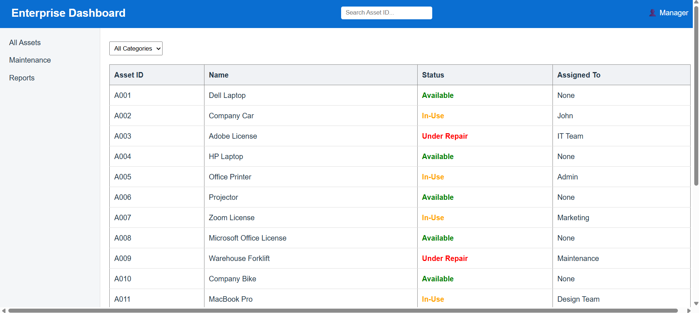

# Enterprise Resource Dashboard (Fiori Style)

## Project Overview
This project is a Business Resource Dashboard built using React and Vite.
It allows managers to view and manage company assets with filtering, search,
and detailed views in an ERP-style interface.

## Dashboard Preview 

## Technology Stack
- React.js
- Vite
- CSS
- Mock JSON Data

## How to Run
npm install
npm run dev

## Features
- Shell Bar with search and user profile
- Side Navigation menu
- Asset management data table
- Status color badges
- Real-time search
- Category filtering
- Detail modal view

## Component Architecture
Header.jsx - Shell bar  
Sidebar.jsx - Navigation menu  
AssetTable.jsx - Data grid  
FilterBar.jsx - Filtering UI  
AssetDetail.jsx - Detail modal  
App.jsx - Main controller
